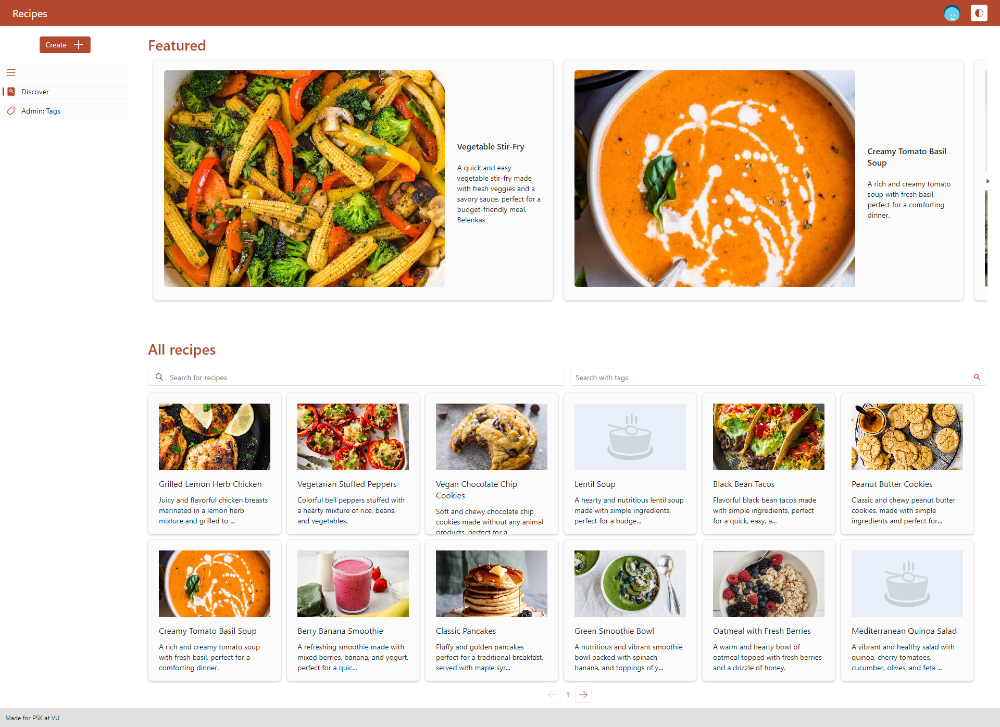

# A system for cooking recipes

Built as part of the "Programų sistemų kūrimas" module at Vilnius University

## System design

## Screenshots

#### Discover page

#### See a recipe

#### Editing a recipe

#### User page

